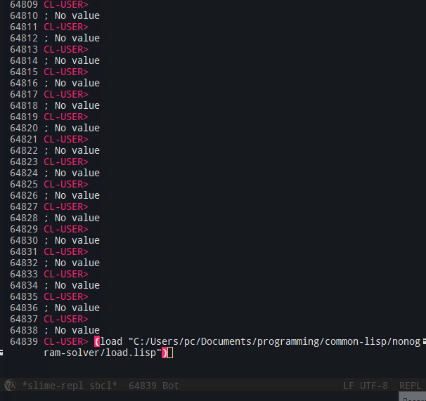
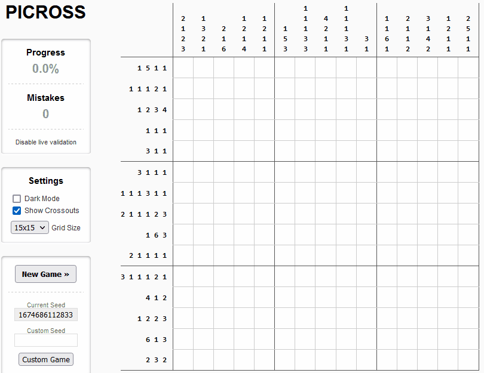

# A nonogram-solver written in Common Lisp

## IMPORTANT

The code provided in this repository is only a sampling of the full project. The full project is over 1500 lines of code, excluding all testing functionality and other data. Note that I created this program without any reference to any other existing nonogram-solvers, and I used no foreign libraries of any kind (except in creating the clicker).

## Purpose of Program

This program is meant to be used to solve nonograms of any size. It is generally effective up to 15 x 15 size nonograms.

It can also be used to learn basic to intermediate nonogram-solving techniques. At execution, this program lists out (via command line) a neat and organized display of each change that it has made to the nonogram along with the "name" of the technique used.

## The Approach Used

I designed this program with a technique-based approach in mind. Nearly every method (see third paragraph for the exception) that changes the nonogram "grid" does so according to some nonogram technique that I have learned in the process of solving nonograms in my spare time. Thus, the full program has many distinct methods that relate to specific techniques of nonogram solving.

Currently, all techniques are line-based, meaning that any row or column of the nonogram is considered abstractly as a single "line". Thus, all techniques try to deduce details about each line only by assessing details that already have been discovered about the line. To be clear, then, my program does not include any advanced nonogram techniques that work by considering multiple lines at the same time.

I created only one "non-standard technique" for this program which is only utilized when the created "techniques" have failed to make any progress. It is the inclusion of this other approach that makes my program run slow sometimes. (If this "non-standard technique" never executes, then my program is quite fast.)

Finally, my solver does not (currently) consider what-if scenarios to build up knowledge of a nonogram. It also does not guess when there are arbitrary solutions.

## Solving

To solve a nonogram with this program, begin by entering a the "clue" data. I have implemented a few ways of doing this - some convenient, others less so. After this, the program will display the created nonogram and then attempt to solve it, while outputting each step it takes.

The program expects to receive a valid assortment of clues.

## Accuracy and Testing

This program should only fail by not finishing the nonogram; it should never give an incorrect move.

As for testing, a move-list is output to the file-system (at the same directory). I created a clicker that uses this move-list and that conforms to a specific nonogram website, so that after running the solver on the appropriate clues, the clicker would apply the appropriate clicks to the web-page's nonogram, verifying the solution. Since I still have not fully automated the process, I have completed roughly only 100+ tests.

 
 

