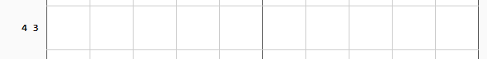

# A nonogram-solver written in Common Lisp


## Purpose of Program

(Primarily this project was done for my own enjoyment.)

This program is meant to be used to solve nonograms of any size. It is generally effective on nonograms up to size 20 x 20, beyond which it is either too slow or simply cannot solve.

It can also be used to aid the user in learning basic to intermediate nonogram-solving techniques. At execution, this program lists out (via command line) an organized display of each change that it has made to the nonogram along with the "name" of the technique used.

As an aside, note that I created this program without any reference to any other existing nonogram-solvers, and I used no foreign libraries or any kind of "import".

## The Approach Used

I designed this program with a technique-based approach in mind. Nearly every method (see third paragraph for the exception) that changes the nonogram "grid" does so according to some nonogram technique that I have learned in the process of solving nonograms in my spare time. Thus, the full program has many distinct methods that relate to specific techniques of nonogram solving.

Currently, all techniques are line-based, meaning that any row or column of the nonogram is considered abstractly as a single "line". Thus, all techniques try to deduce details about each line only by assessing details that already have been discovered about the line. To be clear, then, my program does not include any advanced nonogram techniques that work by considering multiple lines at the same time.

I created only one "non-standard technique" for this program which is only utilized when the created "techniques" have failed to make any progress. It is the inclusion of this other approach that makes my program run slow sometimes. (If this "non-standard technique" never executes, then this program executes quite fast.)

Finally, my solver does not (currently) consider what-if scenarios to build up knowledge of a nonogram. It also does not guess when there are arbitrary solutions.

## Solving

To solve a nonogram with this program, begin by entering the "clue" data. I have implemented a few ways of doing this - some convenient, others less so. After this, the program will display the created nonogram and then attempt to solve it, while outputting each step it takes.

Keep in mind that the program expects to receive a valid assortment of clues. Providing illogical clues is considered user-error, and the program has not been designed to detect this.

## Accuracy and Testing

This program should only fail by not finishing the nonogram; it should never give an incorrect move (assuming all provided clues are logical and correct).

As for testing, a move-list is output to the file-system (at the same directory). I created a clicker that uses this move-list and that conforms to a specific nonogram website, so that after running the solver on the appropriate clues, the clicker would apply the appropriate clicks to the web-page's nonogram, verifying the solution. Since I still have not fully automated the process, I have completed roughly only 100+ tests.

<br>
<br>


<br>
(Note that the code for the clicker is not provided in this repository.)

## Bugs and other issues

First, please note that this program is not complete and is not well tested. I was going through the 3rd or so refactoring a few months back when I started coming up with more ideas for methods to include, but never got around to creating them; thus, there are incomplete sections of code, as well as plenty of comments descibing later plans.

However, there are no known bugs at this time.

## Examples in using the program

### Starting the demo

Load the ASD file for the program (change the path according to file location).
```
(asdf:load-asd #p"enter/path/to/nonogram-solver.asd")
```

Load the demo system.
```
(asdf:load-system "nonogram-solver/cli-demo")
```

Use the correct package.
```
(in-package :nonogram-solver/cli-demo)
```

Run the appropriate function
```
(main-menu)
```

### Loading up the main library

If necessary, return to cl-user package.
```
(in-package :cl-user)
```

If necessary, load the ASD file for the program (again, change the path according to file location)
```
(asdf:load-asd #p"enter/path/to/nonogram-solver.asd")
```

Load the nonogram-solver system.
```
(asdf:load-system "nonogram-solver")
```

Use the correct package.
```
(in-package :nonogram-solver)
```

### Testing main functions against a single line using a macro from main library

Follow the steps for **Loading up the main library**.

To solve for a line with clues as in the provided picture...



Run the following code.
```
(with-single-line-nonogram n l 10 (vector 4 3)
  (print-grid n nil nil nil)
  (find-overlap n l +full-line+))
```

The following text will be output to illustrate the correct markings to be made...
```text
###########################    0     ###########################

       # # # # # # # # # #
 4 3 # - - - - - - - - - -

################################################################

###########################    1     ###########################

FIND-OVERLAP (for full-line) made changes to h-0
(0 . 3) was marked as 1

       # # # # # # # # # #
 4 3 # - - -~1~- - - - - -

################################################################

###########################    2     ###########################

FIND-OVERLAP (for full-line) made changes to h-0
(0 . 2) was marked as 1

       # # # # # # # # # #
 4 3 # - -~1~1 - - - - - -

################################################################

###########################    3     ###########################

FIND-OVERLAP (for full-line) made changes to h-0
(0 . 7) was marked as 1

       # # # # # # # # # #
 4 3 # - - 1 1 - - -~1~- -

################################################################
```
